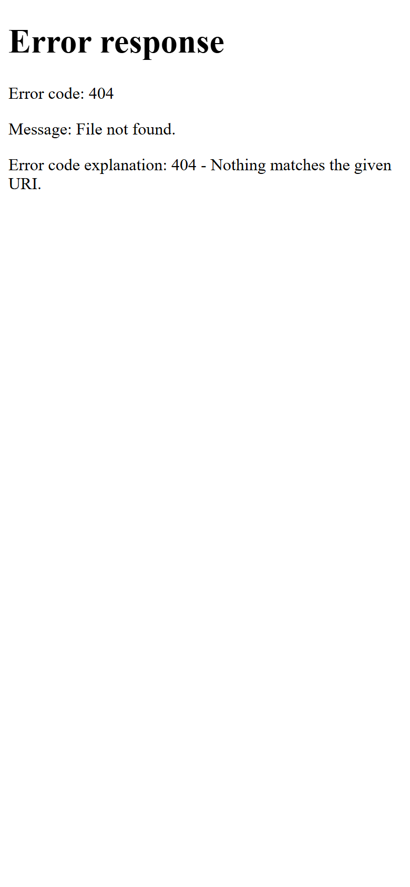

# LudoVerse Kids

A fun and educational Ludo game for kids, built with Flutter and deployed as a web application.

## 🎮 Play the Game

Visit the live website: [https://innnervision.github.io/LudoVerse-Kids/](https://innnervision.github.io/LudoVerse-Kids/)

## 📸 Screenshots

### Menu Screen

### Game Screen

### Adventure Mode

### Shop

### Leaderboard

### Settings

## 🚀 Features

- Classic Ludo gameplay
- Kid-friendly interface
- Adventure mode
- In-game shop
- Leaderboard system
- Colorful animations

## 🛠️ Tech Stack

- Flutter
- Dart
- Firebase (for backend services)

## 📝 License

This project is open source and available under the MIT License.
